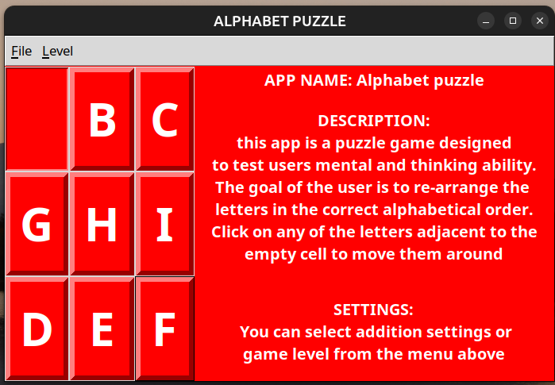
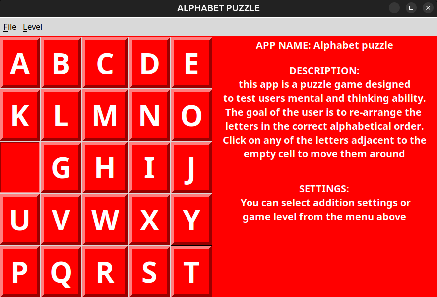

# alphabet_puzzle

**alphabet puzzle app 1.0**
this app is a puzzle game designed to test users mental and thinking ability.
The goal of the user is to re-arrange the letters in the correct alphabetical order.
Click on any of the letters adjacent to the empty cell to move them around

**author: otumuyen Gospel** 

description: this app is  a puzzle game designed  to test users mental  and thinking ability. the goal of user to  re-arrange the letters in the correct alphabetic order.

You can select addition settings or game level from the menu in the puzzle

for example to change game level to something more difficult say you want to play
a 5*5 Grid level just select the menu **LEVEL** as shown in the picture above

here is the output screen for selecting a 5*5 Grid level

